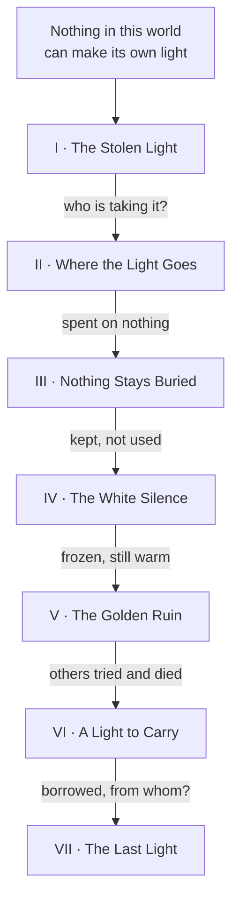
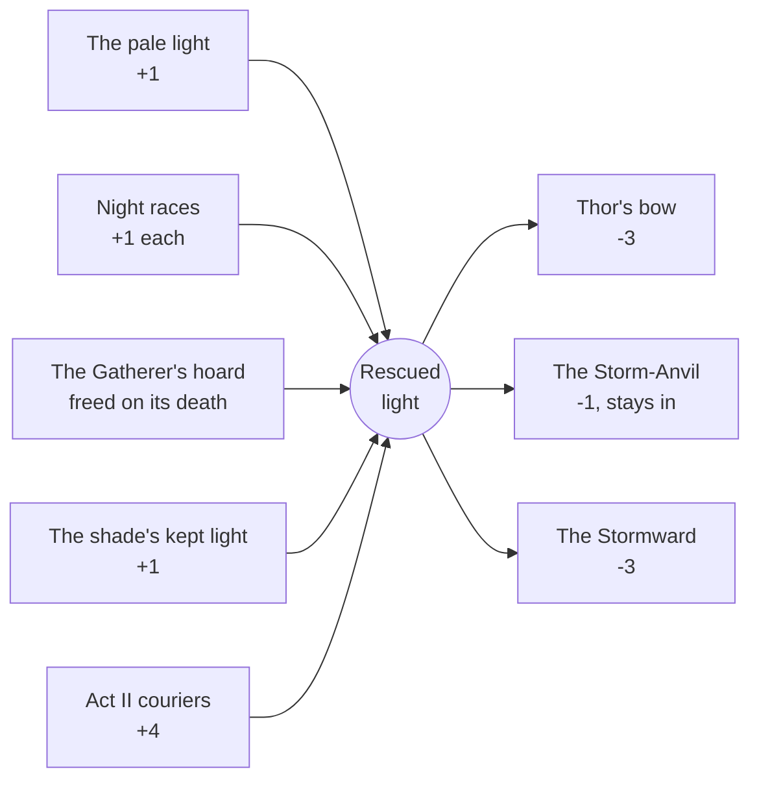

# Saga Atlas

Every questline in the saga, lane by lane, with the story each act is telling and an honest
note on how finished it is.

> **Generated** by `Scripts/saga_atlas.py` from `RunService.cs`. Do not hand-edit: every lane,
> step and target is read out of the source, so the page cannot drift from the code. The prose
> (epigraphs, chapters, status) lives in the generator.

`101` quest steps &middot; `8` acts &middot; `1` played through &middot; `5` tracks in use

## How to read a lane

An act runs two or three questlines **in parallel** - HUNT is what the world makes you do,
CRAFT is what you make, and the third lane is that act's own domestic thread (HEARTH in the
Meadows, FORGE in the forest, MARSH in the fens). Each lane is strictly linear with no skips, so
a lane can stall without stopping the others. A number in a code box is the count the step wants.
The last step of HUNT is the act's god, shown in bold.

## The arc

Acts II to VII are each a *failed answer* to the same shortage, and the question one act fails
to answer is the next act. That is the whole spine, and it is told to the player one chapter at
a time in the BOOK rather than living only in the design notes.

The Deep North is **not** an eighth act. Decided 2026-09-20: it is an epilogue after the hall
and the feast, because a ninth boss after a climax reads as an afterthought and its premise
duplicates Act III's marsh.

## The light economy

Rescued lights are the only currency the lanes share, and they exist so the hunt and the crafts
owe each other something. Acts I and II only - nothing later asks for one, deliberately, because
a craft nobody can finish is a stalled act.

**Act I's budget comes out exactly even: 7 needed, 7 available.** One light to Thjalfi, three
for the bow, three for the shield; one from the pale light, five from the night races, one from
the shade. The Gatherer's freed hoard is the only slack, so a player who loses lights to the
forest may finish the act with only ONE storm item. That is the design, decided 2026-09-20, not
a balance bug to report.

The shade's single kept light is load-bearing beyond its value: Valheim only lists a recipe or
a build piece whose every ingredient the player has *handled*, so that one item is what makes
both Thor's bow and the Storm-Anvil appear at all.

## The questlines

### Act I &mdash; The Stolen Light

`Written & played` &middot; `39 steps` &middot; `3 tracks`

> *Something is taking the light from the meadows. Take it back.*

You came ashore alive, which nothing in this world had managed in an age, and the dark noticed you before anything else did. So you built: an axe, a fire, a bed you called yours. Every night the meadows whispered over it, counting. Then a raven landed and told you why you had been sent, and it was not for the antlered one.

| # | HUNT | CRAFT | HEARTH |
|--:| --- | --- | --- |
| 1 | Feed the camp, and keep it `4` | Craft an axe | Forage the meadows (12 new finds) `12` |
| 2 | Hear the raven out | Craft a hammer | Raise a roof (6 pieces) `6` |
| 3 | Hunt a deer by daylight | Build a workbench | Build a fire |
| 4 | Keep a watch after dark `3` | Upgrade the workbench (2) `2` | Build a cooking station |
| 5 | Follow the pale light | Find the hunter’s shade | Sit down to a proper meal `3` |
| 6 | Take back their light (5) `5` | Bring the shade what it lacked | Build a bed and claim it |
| 7 | Put down the Breaker | Find the one who waits | Settle in (2 min at home) `120` |
| 8 | Hunt Eikthyr's Herald | Pay Thjalfi, and stand back | Sleep through the night |
| 9 | Kill the Gatherer | Strike Thor’s bow at the Storm-Anvil | Make it comfortable (comfort 5) `5` |
| 10 | Find Eikthyr's altar | Bind the Stormward | Build a chest |
| 11 | **Defeat Eikthyr** | Let the Stormward answer (3) `3` | Catch your first fish |
| 12 |  | Stand out in his weather | A good haul (5 fish) `5` |
| 13 |  |  | Tame a boar |
| 14 |  |  | Fishing skill 10 `10` |
| 15 |  |  | A fisherman's larder (5 cooked) `5` |
| 16 |  |  | A pen of three `3` |

**Chapter ends.** Eikthyr came down onto stones his own herd had paid for, and went out. The forest went on being hungry. Nobody had yet asked where it had been carrying everything it took.

### Act II &mdash; Where the Light Goes

`Written, not yet played` &middot; `22 steps` &middot; `3 tracks`

> *The forest has been fed for years. Meet what did the feeding.*

You went after the little ones instead of waiting for them. They had been carrying the meadows away for years, down under the roots to something that had never once come up to collect in person, and nothing had ever followed them home.

| # | HUNT | CRAFT | FORGE |
|--:| --- | --- | --- |
| 1 | Thin the forest `10` | Reach the Black Forest | Claim Eikthyr’s power |
| 2 | Fell 3 Brutes `3` | Mine the Black Forest (40 hits) `40` | Hang a trophy |
| 3 | Rob the couriers (4 lights) `4` | Find the burial chambers | Raise a raft |
| 4 | Find the Elder's altar | Take cores from the dead (10) `10` | Raise a cart |
| 5 | **Defeat The Elder** | Build a smelter | Name your holding |
| 6 |  | Forge three things in bronze `3` | Find the trader |
| 7 |  | Beat out the Stormsworn helm |  |
| 8 |  | Build a portal |  |
| 9 |  | Plant a crop (10 seeds) `10` |  |
| 10 |  | Build a beehive |  |
| 11 |  | Grow the herd (4 penned) `4` |  |

**Chapter ends.** The Elder burned, and everything it had been fed went out with it. So that was where the light had gone: nowhere. The world was darker than the day you landed.

### Act III &mdash; Nothing Stays Buried

`Written, not yet played` &middot; `12 steps` &middot; `3 tracks`

> *What the marsh takes, it keeps.*

The marsh had taken for longer than the forest and had never spent a thing. You waded in after what it was holding and found out what happens to the ones who stay.

| # | HUNT | CRAFT | MARSH |
|--:| --- | --- | --- |
| 1 | Clear the mire `8` | Reach the Swamp | Claim the Elder’s power |
| 2 | Fell an Abomination | Haul out 20 Scrap Iron `20` | Build a fermenter |
| 3 | Find Bonemass's altar | Iron enough to stand in (10) `10` | Chart the marshes |
| 4 | **Defeat Bonemass** | Rivet the Stormsworn cuirass | Sail the fens `600` |

**Chapter ends.** Nothing in the marsh had been carrying light anywhere. It had simply been kept — the first hoard you had found that nobody was using.

### Act IV &mdash; The White Silence

`Written, not yet played` &middot; `8 steps` &middot; `2 tracks`

> *Above the treeline, even light freezes.*

Above the treeline nothing moved and nothing rotted and nothing was hungry. The cold had been holding what it took for so long that it had stopped behaving like a thief.

| # | HUNT | CRAFT |
|--:| --- | --- |
| 1 | Hunt the white silence `6` | Claim Bonemass’ power |
| 2 | Kill 2 Stone Golems `2` | Reach the Mountains |
| 3 | Find Moder's altar | Bring up 15 Silver Ore `15` |
| 4 | **Defeat Moder** | Work the Stormsworn greaves |

**Chapter ends.** Moder fell out of her own sky and the mountain gave up what it had been keeping. It was still warm, which was worse than any answer you had had so far.

### Act V &mdash; The Golden Ruin

`Written, not yet played` &middot; `8 steps` &middot; `2 tracks`

> *They harvested a god’s herd before you. See how it ended.*

Somebody had done all of this before you. The plains were built out of their leavings, and the fuling had put their huts on top without asking what any of it had been for.

| # | HUNT | CRAFT |
|--:| --- | --- |
| 1 | Break the plains `10` | Claim Moder’s power |
| 2 | Kill 2 Fuling Berserkers `2` | Reach the Plains |
| 3 | Find Yagluth's altar | Cure the Stormsworn mantle |
| 4 | **Defeat Yagluth** | Build a windmill |

**Chapter ends.** The first harvesters were dust in the fields they had cleared, and you were standing in their answer. It had not worked for them either.

### Act VI &mdash; A Light to Carry

`Thin stand-in` &middot; `5 steps` &middot; `2 tracks`

> *The dvergr borrow light and give it back. Learn how.*

In the mist there were lamps, and the lamps were not stolen. The dvergr had worked out how to borrow light and hand it back, and had no intention of explaining it.

| # | HUNT | CRAFT |
|--:| --- | --- |
| 1 | Thin the nests `8` | Claim Yagluth’s power |
| 2 | Find the Queen’s lair | Reach the Mistlands |
| 3 | **Defeat the Queen** |  |

### Act VII &mdash; The Last Light

`Thin stand-in` &middot; `5 steps` &middot; `2 tracks`

> *Where light goes to end. Follow it in.*

Every thread you had pulled ran the same direction, and it ran here, where everything has already burned once. You followed it in.

| # | HUNT | CRAFT |
|--:| --- | --- |
| 1 | Cut through the charred `8` | Claim the Queen’s power |
| 2 | Find Fader’s seat | Reach the Ashlands |
| 3 | **Defeat Fader** |  |

### Act VIII &mdash; What the Cold Keeps

`Placeholder` &middot; `2 steps` &middot; `2 tracks`

> *Ice does not take light. It keeps it. Find out from whom.*

Nothing in the far north has thawed since before the herd, and the ice is not hungry and never was. It has only been keeping something.

| # | HUNT | CRAFT |
|--:| --- | --- |
| 1 | **Defeat what the cold keeps** | Reach the Deep North |

